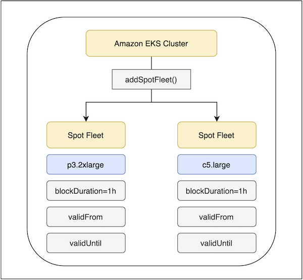

# Welcome to `eks-spot` project!

This project aims to help you provison Amazon EKS cluster with `EC2 Spot Blocks` for defined duration workloads.




## Features

- [x] Extending the upstream AWS CDK `aws-eks` construct libraries
- [x] `addSpotFleet()` to create your spot fleet for your cluster
- [x] define your `blockDuration`, `validFrom` and `validUntil` for fine-graned control


## Usage

Make sure you have installed `aws-cdk`

```bash
$ cdk --version
```

```bash
# git clone this project
git clone https://github.com/pahud/aws/eks-spot.git
# cd into the cdk directory
cd eks-spot/cdk
# bootstrap your region for the first time
cdk bootstrap
# cdk diff to see what's going to be created
cdk diff
# deploy it
cdk deploy
```

## To deploy into existing VPC or other AWS_REGION

Use `-c use_default_vpc=1` to deploy into your default VPC 

```bash
# to deploy into the default vpc
$ cdk diff -c use_default_vpc=1
```

Use `-c use_vpc_id=vpc-xxxxxx` to deploy into any existing VPC

```bash
# to deploy into vpc-xxxxxx
$ cdk diff -c use_vpc_id=vpc-xxxxxx
```

Use `AWS_REGION` to override the default region

To deploy in to `ap-northeast-1`

```bash
$ AWS_REGION=ap-norteast-1 cdk diff -c use_vpc_id=vpc-xxxxxx
```

Use `--profile` to specify different `AWS_PROFILE`

```bash
# deploy in to AWS China Ningxia region
$ AWS_REGION=cn-northwest-1 cdk --profile cn cdk diff 
# deploy in to AWS China Beijing region
$ AWS_REGION=cn-north-1 cdk --profile cn cdk diff 
```

## Destroy and clean up

```bash
$ cdk destroy
```


## Sample

```ts
#!/usr/bin/env node
import 'source-map-support/register';
import * as cdk from '@aws-cdk/core';
import * as ec2 from '@aws-cdk/aws-ec2';
import { EksSpotCluster, ClusterVersion, BlockDuration } from '../lib/eks-spot';


function addDays(date: Date, days: number): Date {
  date.setDate(date.getDate() + days);
  return date;
}

function addHours(date: Date, hours: number): Date {
  date.setHours(date.getHours() + hours);
  return date;
}

function addMinutes(date: Date, minutes: number): Date {
  date.setMinutes(date.getMinutes() + minutes);
  return date;
}


const app = new cdk.App();

const env = {
  region: process.env.CDK_DEFAULT_REGION,
  account: process.env.CDK_DEFAULT_ACCOUNT
};

const stack = new cdk.Stack(app, 'EksSpotStack', { env });

// create a 1.16 eks cluster with empty capacity
const clusterStack = new EksSpotCluster(stack, 'Cluster', { 
  clusterVersion: ClusterVersion.KUBERNETES_116,
});

// add the 1st spotfleet with 2 p3.2xlarge spot block instances for six hours
// and terminate this fleet after then
clusterStack.addSpotFleet('OneHourFleet', {
  blockDuration: BlockDuration.SIX_HOURS,
  targetCapacity: 2,
  defaultInstanceType: new ec2.InstanceType('p3.2xlarge'),
  validUntil: addHours(new Date(), 6).toISOString(),
  terminateInstancesWithExpiration: true
})

// add the 2nd spotfleet with 2 c5.large spot block instances for one hour
// and terminate this fleet after then
clusterStack.addSpotFleet('TwoHourFleet', {
  blockDuration: BlockDuration.ONE_HOUR,
  targetCapacity: 2,
  defaultInstanceType: new ec2.InstanceType('c5.large'),
  validUntil: addHours(new Date(), 1).toISOString(),
  terminateInstancesWithExpiration: true
})

```
